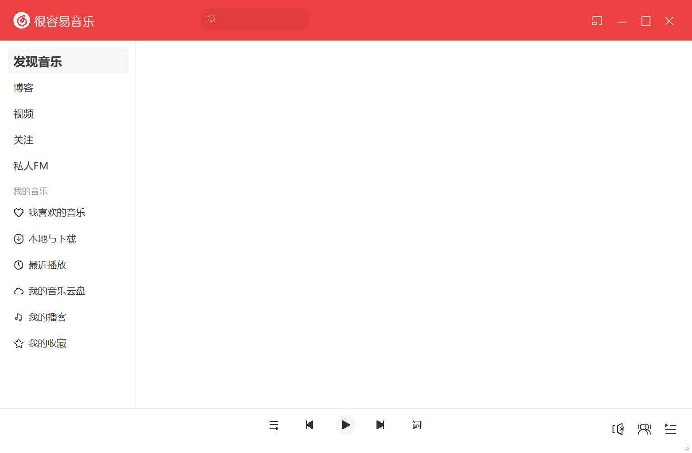

# 很容易音乐
这是一个致力于用C++和win32api打造的开源第三方网易云音乐。就目前而言，与普通的项目相比，这个项目更像一个“玩具”项目。由于作者是编程新手，水平有限，项目中可能有相当多的问题代码。因此我不建议你从它当中学习我们的编程习惯。

# 开源的目的
此项目以BSD 3-Clause “New” or “Revised” License协议开源。我希望有更多人参与到这个项目的贡献中，促进交流，共同学习与进步。与普通的项目不同的是，这个项目更像一个“玩具”项目，实际上可能并不能产生多大的价值。所以无论你的技术、你的年龄段、你的想法、你的性别如何，只要你对C++、win32api或者此项目感兴趣，任何人都可以参与这个项目的开发。对于新手来说，和我一样，你只管放心大胆的去完成你的想法。而对于老手来说，你可以很容易的发现我们的代码中存在的问题，如果你能从中指出我们的问题，这对我们的帮助会非常大。我希望新手和老手能够友好交流，互相理解互相包容。同时，如果你有任何的想法都可以提出来。
# TODO清单

- [x] 基本播放器类
- [x] 页面导航
- [x] 音乐搜索
- [x] 窗口大小的基本操作
- [x] tooltip提示框
- [ ] 解决GDI资源泄露问题
- [ ] 解决窗口闪烁的问题
- [ ] 登录等用户相关类
- [ ] 音乐播放列表
- [x] 支持显示图片
- [ ] 各导航相关页面
- [ ] 动画引擎
- [ ] 切换主题
- [ ] 页面滚动功能
- [ ] 优化项目结构，力争组件化
- [ ] 系统托盘图标
- [ ] 接入网易云官方api
- [ ] 桌面歌词
- [ ] 歌词预览界面
- [ ] 接入系统Thumbnail Toolbar

# 截图
  

  

# 原项目编译器
[MinGW GCC13.1.10](https://github.com/niXman/mingw-builds-binaries)

目前换上了xmake构建工具，非常方便。  
[点击这里](https://github.com/heyManNice/EasyMusic/issues/3)查看具体用法。目前只需要你的电脑正确安装了 VS 2022后在./执行```xmake -y```即可编译。  
但是有一个问题，当前程序读取的资源文件是外置的相对路径。后面研究之后把资源转换成打包进程序的形式。目前编译好了之后，还要把./res文件夹复制到和程序一样的目录，程序才能正常运行。目前还不知道如何设置编译之后的程序图标。

# 原项目编辑器
DEV-C++ 6.7.5

目前换上了vscode + xmake + C/C++扩展的形式。体验还不错。比较坑的是得在开始菜单中找到Developer PowerShell for VS 2022，打开之后输入code启动的vscode才能正常运行。
# 命名规则
- 文件名应该全部小写，可以包含下划线，例如 `my_class.h`

- 类型名应该使用大写字母开头，每个单词首字母大写，不包含下划线，例如 `MyClass` 或 `MyEnum`

- 变量名应该全部小写，单词之间用下划线连接，例如 `my_variable` 或 `my_local_variable`类的成员变量以下划线结尾，例如 `my_member_variable_`

- 常量名应该以 `k` 开头，后面跟一个大写字母，然后是小写字母和下划线，例如 `kDaysInAWeek` 或 `kMaxBufferSize`

- 函数名应该使用大写字母开头，每个单词首字母大写，不包含下划线，例如 `MyFunction` 或 `MyMethod`

- 枚举、联合、宏和枚举值应该全部大写，单词之间用下划线连接，例如 `MY_ENUM` 或 `MY_MACRO`

# 用到的Github开源项目
[yyjson](https://github.com/ibireme/yyjson)  
[NeteaseCloudMusicApi](https://github.com/Binaryify/NeteaseCloudMusicApi)

# 目前所使用的线上api来源
[cloud-music.pl-fe.cn](http://cloud-music.pl-fe.cn/)

# 用到的静态链接库
音乐播放：WinMM.Lib  
网络请求：wininet.Lib  
窗口效果：dwmapi.lib  
解析jpeg文件：FreeImage.lib(还未开始使用)  
绘图设备：gdiplus.lib(目前使用gdi)

# 各文件(夹)功能
## 文件夹
~~lib：静态链接库~~  
res：资源文件  
yyjson：yyjson解析库相关文件  
SampleImage：readme.md的图片文件
tooltip：tooltip相关文件
## 头文件  
myhead.h：项目万用头（各种定义都放里面，后面逐步拆散）
## cpp文件
all_class.cpp：窗口类注册  
all_proc.cpp：窗口事件循环过程  
foot_tool.cpp：底部栏  
gdi_device.cpp：gdi绘图设备复用和安全切换  
head_tool.cpp：顶部栏  
navigation_bar.cpp：左侧边导航栏  
main.cpp：主程序入口  
mytools.cpp：各种小工具  
network.cpp：网络请求相关  
player.cpp：音乐播放器抽象类  
## 其他文件
xmake.lua：xmake的工程文件
EasyMusic.ico：项目图标  
Makefile.win：编译规则文件（DEV-C++自动生成）
# 协作
## 1.如果你想加入此项目的协作组织并作出贡献  
请[点击这里](https://space.bilibili.com/226975720)并私信联系我

## 2.如果你只想为我们贡献你的代码  
请将此项目Fork之后，clone到你的机器上，新建分支，做出修改后并推送到你的仓库，并在你的仓库的“pull request”页面中创建拉起请求。我们会查看你的代码并做出回应。  
更多详细信息请参考[这里](https://docs.github.com/zh/pull-requests/collaborating-with-pull-requests/proposing-changes-to-your-work-with-pull-requests/about-pull-requests)或者在互联网上搜索其他教程。

## 3.如果你想为我们指出问题和表达你的想法  
请[点击这里](https://github.com/heyManNice/EasyMusic/issues/new)
